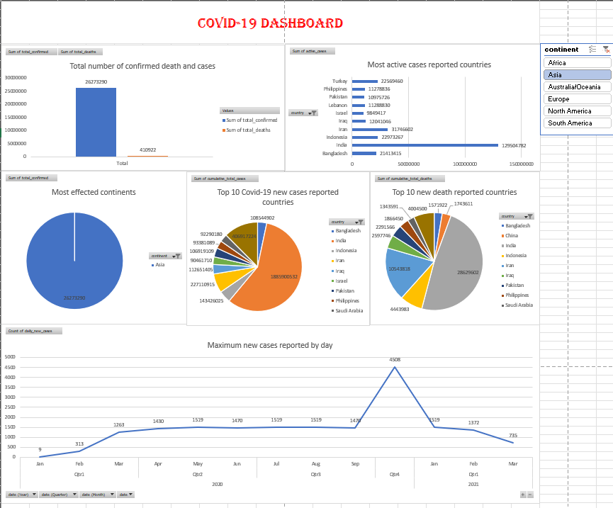
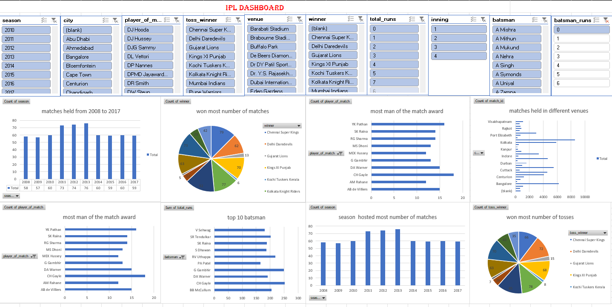

# Excel Projects

This folder contains interactive dashboards and analyses built in Excel.  
Each project demonstrates skills in pivot tables, slicers, charts, and KPI visualization.

## 📂 Projects

### [Covid-19 Dashboard](Covid19/)
- Global Covid-19 analysis with continent filters and top 10 country breakdowns.
- Techniques: Pivot tables, slicers, bar/pie/line charts.
- Key insight: Asia reported the highest number of cases; Bangladesh and China had the largest new case counts.

---

### [IPL Dashboard](IPL/)
- IPL matches (2008–2017) analyzed with filters for season, city, venue, toss winner, and player of the match.
- Techniques: Pivot tables, slicers, bar/pie charts.
- Key insight: Chennai Super Kings won the most matches; SK Raina and RG Sharma were top performers.

---

### [SuperMarket Sales](SuperMarket%20Sales/)
- Sales performance across product categories, cities, and payment methods.
- Techniques: Pivot tables, conditional formatting, bar/pie/line charts.
- Key insight: Health & Beauty products generated the highest gross income; Naypyitaw city contributed the most revenue.

---

### [Visual Gaming Dashboard](VISUAL%20GAMING%20DASHBOARD/)
- Gaming activity and revenue across Indian states.
- Techniques: Pivot tables, bar/pie/line charts, trend analysis.
- Key insight: Bihar generated the highest revenue
