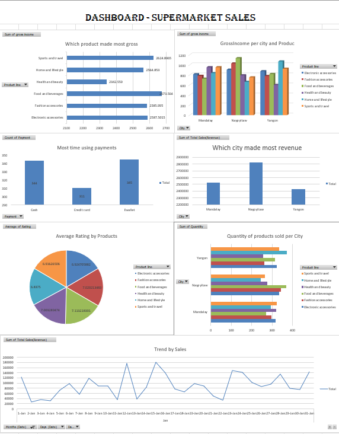

# SuperMarket Sales Dashboard (Excel)

## 📌 Overview
Excel dashboard analyzing supermarket sales performance across product categories, cities, and payment methods.

## 📂 Dataset
- Source: Supermarket sales dataset
- Format: Excel file with transaction records

## ⚙️ Techniques Used
- Pivot tables for revenue and gross income
- Charts (bar, pie, line) for visualization
- Conditional formatting for KPIs

## 📊 Key Insights
- Health & Beauty products generated the highest gross income.
- Naypyitaw city contributed the most revenue.
- E-wallet was the most used payment method.

## 🖼 Screenshot

## 📁 Files in This Folder
- `SuperMarket.xlsx`
- `SuperMarket-Sales.png`
- `README.md`
