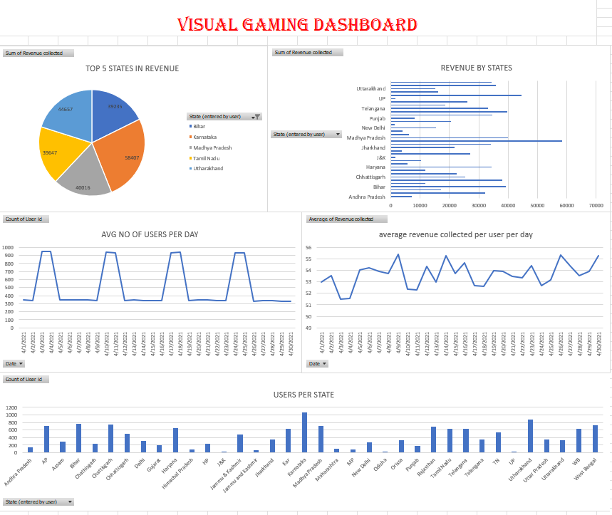

# Visual Gaming Dashboard (Excel)

## 📌 Overview
Excel dashboard analyzing gaming activity and revenue across Indian states.  
Includes metrics on users, revenue, and average daily activity.

## 📂 Dataset
- Source: Gaming dataset
- Format: Excel file with state-wise user and revenue data

## ⚙️ Techniques Used
- Pivot tables for state-level analysis
- Charts (bar, pie, line) for visualization
- Trend analysis for daily users and revenue

## 📊 Key Insights
- Bihar generated the highest revenue among states.
- Average daily users peaked around 900–1000.
- Karnataka and Tamil Nadu contributed significantly to revenue.

## 🖼 Screenshot

## 📁 Files in This Folder
- `Gaming.xlsx`
- `Visual-Gaming-Dashboard.png`
- `README.md`
