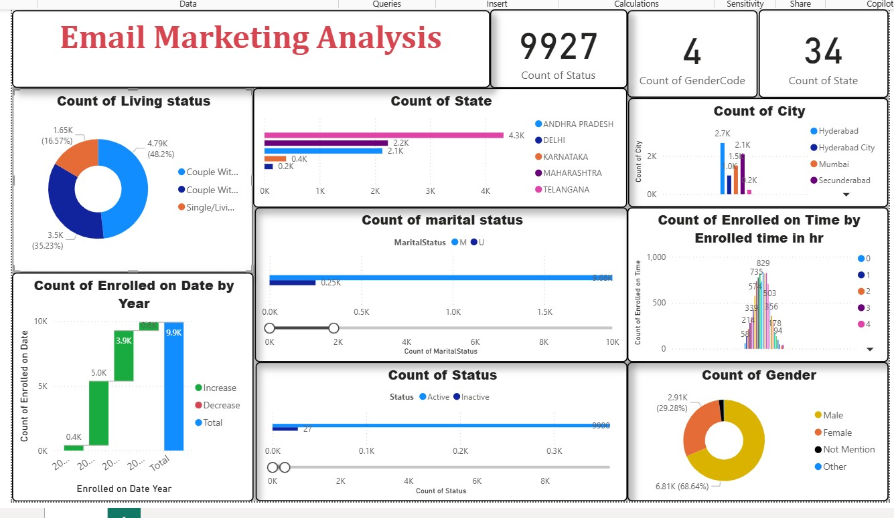

# Email Marketing Analysis (Power BI)

## 📌 Overview
Dashboard analyzing email marketing campaign performance, demographics, and engagement metrics.

## 📂 Dataset
- Source: Email marketing dataset
- Format: CSV/Excel with demographic and campaign data

## ⚙️ Techniques Used
- Power BI data modeling
- DAX measures for engagement KPIs
- Interactive filters and slicers

## 📊 Key Insights
- Majority of users were male.
- Most users were couples with children.
- Hyderabad had the highest enrollments.

## 🖼 Screenshot

## 📁 Files in This Folder
- `Email Marketing Analysis.pbix` → Power BI dashboard
- `EmailMarketingAnalysis.jpg` → Screenshot
- `README.md` → Documentation
