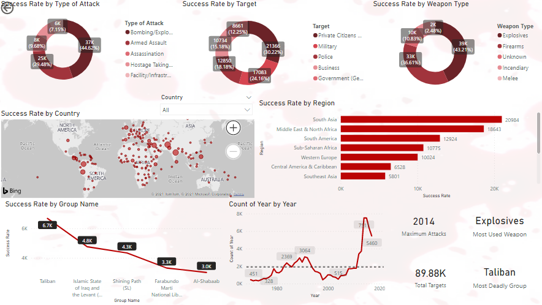

# Global Terrorism Analysis (Power BI)

## 📌 Overview
Comprehensive Power BI dashboard analyzing terrorist incidents worldwide.  
Includes attack types, targets, weapon usage, regions, and groups.

## 📂 Dataset
- Source: Global Terrorism Database
- Format: CSV/Excel with incident records

## ⚙️ Techniques Used
- Power BI data modeling
- DAX measures for success rates
- Map visuals and trend charts

## 📊 Key Insights
- Taliban and ISIL were the most deadly groups.
- Explosives were the most used weapon type.
- Peak attacks occurred in 2014.

## 🖼 Screenshot

## 📁 Files in This Folder
- `Global Terrorism Analysis.pbix` → Power BI dashboard
- `GlobalTerrorism.png` → Screenshot
- `README.md` → Documentation
