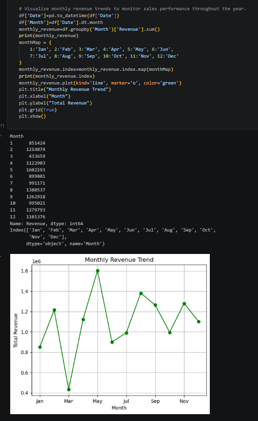
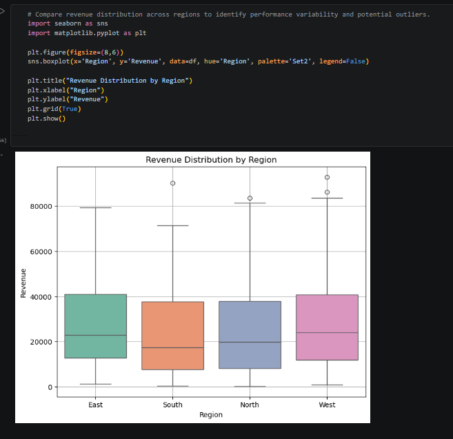
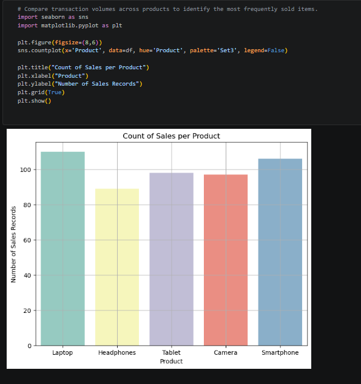
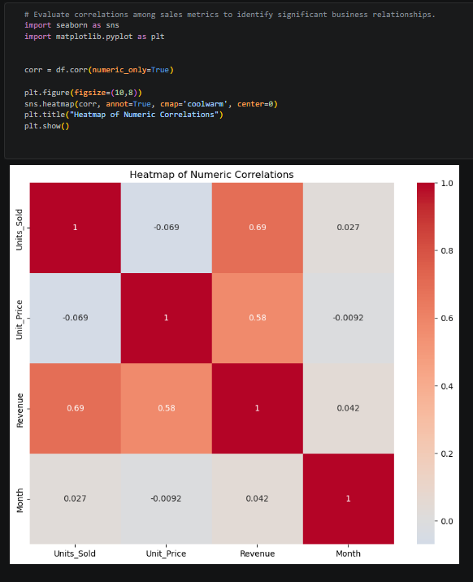

# 📈 Sales Data Analysis

A Python-based data analysis project that explores sales transaction data using **NumPy, Pandas, Matplotlib, and Seaborn**. The analysis evaluates business performance across products, regions, pricing, and time through exploratory data analysis (EDA), statistical techniques, and data visualization.

The project demonstrates how sales data can be transformed into actionable business insights to support revenue optimization, inventory planning, and strategic decision-making.

---

## 📌 Project Overview

The objective of this project is to analyze sales transaction data to understand revenue trends, product performance, regional sales distribution, and pricing patterns.

Using Python and data analysis libraries, the project identifies business trends, evaluates key sales metrics, and uncovers insights that support data-driven business decisions.

---

## 🎯 Business Problem

A retail organization wants to evaluate its sales performance to answer key business questions such as:

- Which regions generate the highest revenue?
- Which products contribute the most to sales?
- How does revenue change throughout the year?
- Is there a relationship between product pricing and revenue?
- Which business metrics are most strongly correlated?

The analysis supports inventory planning, pricing strategies, regional sales optimization, and business performance monitoring.

---

## 📂 Dataset

The dataset contains **500 sales transactions** with the following attributes:

- Date
- Region
- Product
- Units Sold
- Unit Price
- Revenue

**Revenue Calculation**

```text
Revenue = Units Sold × Unit Price
```

---

## 🛠 Tools & Technologies

- Python
- NumPy
- Pandas
- Matplotlib
- Seaborn
- Jupyter Notebook

---

## 🔄 Project Workflow

1. Data Loading
2. Data Quality Assessment
3. Exploratory Data Analysis (EDA)
4. Statistical Analysis
5. Sales Performance Analysis
6. Data Visualization
7. Business Insight Generation

---

## 📊 Analysis Performed

### Data Exploration

- Dataset validation
- Missing value analysis
- Descriptive statistics

### Revenue Analysis

- Overall revenue statistics
- Revenue estimation after tax
- High-value transaction identification

### Regional Performance Analysis

- Total revenue by region
- Revenue distribution across regions

### Product Performance Analysis

- Best-selling products
- Average selling price by product
- Product-wise sales volume

### Time-Series Analysis

- Monthly revenue trends
- Highest revenue month

### Business Insights

- Product performance across regions
- Correlation among sales metrics
- Relationship between pricing and revenue

---

## 📈 Visualizations

### Monthly Revenue Trend

Shows revenue trends over time, helping identify seasonal sales patterns and business growth.



---

### Revenue Distribution by Region

Compares revenue generated across different regions to identify high-performing markets.



---

### Sales Count by Product

Displays product-wise sales volume to identify the best-selling products.



---

### Correlation Heatmap

Visualizes relationships among key sales metrics to identify significant correlations.



---

### Unit Price vs Revenue

Illustrates the relationship between product pricing and generated revenue.


---

## 🔍 Key Insights

- Identified the highest-performing sales regions based on revenue.
- Determined the best-selling products by sales volume.
- Evaluated monthly revenue trends to identify seasonal performance patterns.
- Analyzed pricing and revenue relationships to better understand sales behavior.
- Compared regional revenue distribution to identify market opportunities.
- Identified correlations among key sales metrics using statistical analysis.

---

## 💼 Business Recommendations

- Increase inventory levels for consistently high-performing products.
- Allocate additional sales and marketing efforts to top-performing regions.
- Investigate lower-performing months to improve seasonal sales performance.
- Review pricing strategies for products generating lower revenue.
- Use regional sales insights to optimize marketing campaigns and business planning.

---

## 💡 Skills Demonstrated

- Python Programming
- Data Cleaning
- Exploratory Data Analysis (EDA)
- NumPy Statistical Analysis
- Pandas Data Manipulation
- Time-Series Analysis
- Correlation Analysis
- Data Visualization
- Business Insight Generation

---

## 📁 Project Structure

```text
Sales-Data-Analysis/
│── sales_data.csv
│── Sales Data Analysis.ipynb
│── README.md
│── requirements.txt
│── images/
│   ├── monthly_revenue_trend.png
│   ├── revenue_distribution_by_region.png
│   ├── sales_count_by_product.png
│   ├── correlation_heatmap.png
│   └── unit_price_vs_revenue.png
```

---

## 🚀 Learning Outcomes

- Applied Python libraries to clean, transform, and analyze sales data.
- Performed exploratory and statistical analysis to identify business trends.
- Developed visualizations to communicate sales performance effectively.
- Strengthened practical skills in data analysis, visualization, and business storytelling.
