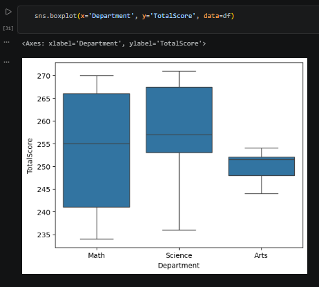
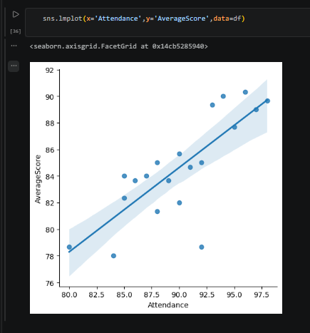
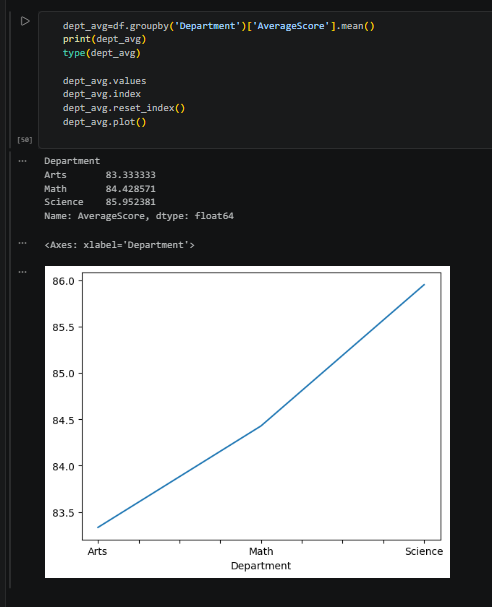
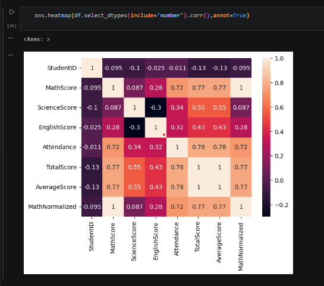

# 🎓 Student Performance Analysis

A Python-based data analysis project that explores student academic performance using **NumPy, Pandas, Matplotlib, and Seaborn**. The analysis evaluates subject scores, attendance, departmental performance, and overall academic achievement through exploratory data analysis (EDA), statistical techniques, and data visualization.

The project demonstrates how educational data can be transformed into actionable insights to support academic planning and data-driven decision-making.

---

## 📌 Project Overview

The objective of this project is to analyze student performance across multiple departments by examining academic scores, attendance, and overall achievement.

Using Python and data analysis libraries, the project identifies performance trends, evaluates departmental outcomes, and explores relationships between attendance and academic success.

---

## 🎯 Business Problem

Educational institutions need to monitor student performance to identify learning gaps, recognize high-achieving students, and improve overall academic outcomes.

This analysis helps answer questions such as:

- Which departments perform best academically?
- Who are the top-performing students?
- Does attendance influence academic performance?
- How are student scores distributed across departments?
- What relationships exist between different academic subjects?

---

## 📂 Dataset

The dataset contains student academic records, including:

- Student ID
- Student Name
- Department
- Math Score
- Science Score
- English Score
- Attendance

---

## 🛠 Tools & Technologies

- Python
- NumPy
- Pandas
- Matplotlib
- Seaborn
- Jupyter Notebook

---

## 🔄 Project Workflow

1. Data Loading
2. Data Quality Assessment
3. Data Cleaning & Transformation
4. Feature Engineering
5. Exploratory Data Analysis (EDA)
6. Statistical Analysis
7. Data Visualization
8. Business Insight Generation

---

## 📊 Analysis Performed

### Data Preparation

- Validated missing values
- Calculated total student scores
- Calculated average scores
- Categorized student performance levels

### Student Performance Analysis

- Identified top-performing students by department
- Compared departmental academic performance
- Evaluated attendance across different performance categories

### Statistical Analysis

- Analyzed score distributions
- Evaluated score variance
- Performed correlation analysis using NumPy

### Data Visualization

- Department-wise score distribution
- Attendance vs. average score analysis
- Department average score comparison
- Performance correlation heatmap

---

## 📈 Visualizations

### Department Score Distribution

Shows the distribution of student scores across departments, helping identify variations in academic performance.



---

### Attendance vs Average Score

Illustrates the relationship between student attendance and average academic performance.



---

### Department Average Score Trend

Compares average academic performance across departments to identify high- and low-performing groups.



---

### Performance Correlation Heatmap

Visualizes correlations among subject scores and attendance to identify relationships between academic performance indicators.



---

## 🔍 Key Insights

- Identified top-performing students across different departments.
- Compared academic performance to identify departmental strengths and improvement areas.
- Observed a positive relationship between attendance and academic performance.
- Analyzed score distributions to understand performance variability.
- Identified correlations among academic subjects using statistical analysis.

---

## 💼 Business Recommendations

- Provide targeted academic support for lower-performing students.
- Encourage improved attendance to enhance academic outcomes.
- Use departmental performance metrics to evaluate teaching effectiveness.
- Recognize consistently high-performing students through academic excellence programs.
- Continuously monitor performance trends to support informed academic planning.

---

## 💡 Skills Demonstrated

- Python Programming
- Data Cleaning
- Feature Engineering
- Exploratory Data Analysis (EDA)
- NumPy Statistical Analysis
- Pandas Data Manipulation
- Correlation Analysis
- Data Visualization
- Business Insight Generation

---

## 📁 Project Structure

```text
Student-Performance-Analysis/
│── student_performance.csv
│── Student Performance Analysis.ipynb
│── README.md
│── requirements.txt
│── images/
│   ├── attendance_vs_average_score.png
│   ├── department_average_score_trend.png
│   ├── department_score_distribution.png
│   └── performance_correlation_heatmap.png
```

---

## 🚀 Learning Outcomes

- Applied Python libraries to clean, transform, and analyze academic data.
- Performed exploratory and statistical analysis to identify performance trends.
- Developed visualizations to communicate insights effectively.
- Strengthened practical skills in data analysis, visualization, and business storytelling.
