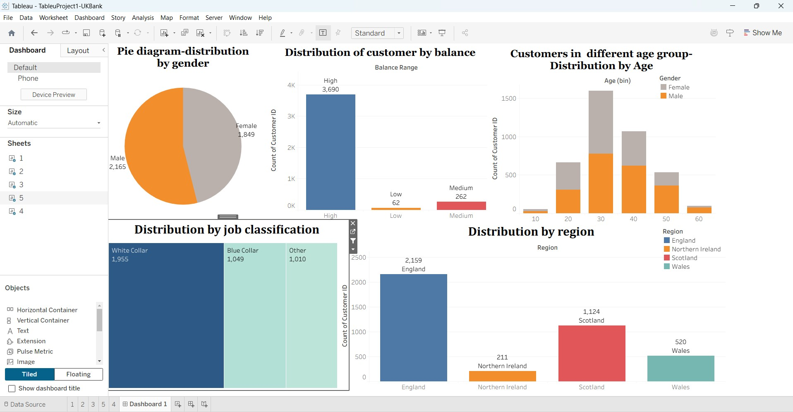

# 🏦 UK Bank Customer Analysis Dashboard

An interactive Tableau dashboard developed to perform Exploratory Data Analysis (EDA) on UK bank customer data. The dashboard provides insights into customer demographics, regional distribution, account balances, and job classifications, helping understand the composition of the bank's customer base through visual analytics.

---

## 📌 Project Overview

The objective of this project is to explore and visualize customer data from a UK bank using Tableau. By analyzing customer characteristics such as region, gender, age, balance, and occupation, the dashboard helps identify customer distribution patterns and supports data-driven business understanding.

This project was created as part of an Exploratory Data Analysis (EDA) exercise to strengthen Tableau dashboard development and data visualization skills.

---

## 🎯 Objectives

- Analyze customer distribution across different UK regions.
- Understand gender-wise customer distribution.
- Segment customers based on age groups.
- Classify customers according to account balance categories.
- Explore customer occupation through job classification.
- Build an interactive dashboard for customer segmentation.

---

## 📂 Dataset

**Dataset:** UK Bank Customers

The dataset contains customer demographic and banking information, including:

- Customer ID
- Gender
- Age
- Region
- Account Balance
- Job Classification

---

## 🛠 Tools & Techniques

- Tableau Desktop
- Exploratory Data Analysis (EDA)
- Dashboard Design
- Customer Segmentation
- Pie Chart
- Bar Chart
- Treemap
- Age Bins
- Table Calculations
- Parameters

---

## 📊 Dashboard Components

The dashboard consists of five visualizations:

### 1. Gender Distribution
Displays the proportion of male and female customers using a pie chart.

### 2. Customer Balance Distribution
Categorizes customers into High, Medium, and Low balance groups to understand balance segmentation.

### 3. Age Distribution
Shows customer distribution across different age groups using age bins.

### 4. Job Classification
Visualizes customer occupation categories using a treemap.

### 5. Regional Distribution
Displays the number of customers across different UK regions, including England, Scotland, Wales, and Northern Ireland.

---

## 🔍 Key Insights

- England has the largest customer base among all regions.
- Male customers slightly outnumber female customers.
- The majority of customers belong to the 30–40 age group.
- Most customers fall within the High Balance category.
- White Collar professionals represent the largest job classification segment.

---

## 💡 Skills Demonstrated

- Data Visualization
- Exploratory Data Analysis
- Customer Segmentation
- Tableau Dashboard Development
- Business Data Interpretation
- Interactive Dashboard Design

---

## 🖼 Dashboard Preview



---

## 📁 Project Structure

```
UK-Bank-Customer-Analysis/
│── UKBankAnalysis.twbx
│── TableuProject1-UKBank.jpg
│── README.md
```

---

## 🚀 Learning Outcomes

Through this project, I gained hands-on experience in:

- Designing interactive dashboards in Tableau.
- Applying exploratory data analysis techniques.
- Using parameters, table calculations, and age bins.
- Creating multiple chart types to communicate insights effectively.
- Presenting customer segmentation through visual storytelling.